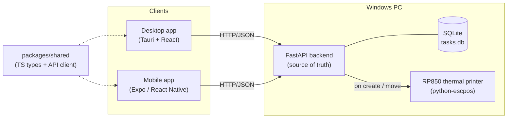

# TaskBoard — a receipt-printing Kanban

A real, cross-platform task board where **every new task and every status change prints to a
thermal receipt printer** (a Rongta RP850). Organize work into **subjects** (boards) and
**swimlanes**, track **progress** and **comments**, from a **desktop app** or a **phone**.

> Portfolio project. One backend of record, two clients, and a physical side effect: your tasks
> come out of a printer.

## Architecture



- **Backend** — FastAPI + SQLite, the single source of truth. Runs on the PC the printer is attached
  to. Reuses [`rp850-printer`](../rp850-printer) (`build_receipt` / `get_printer`) to print.
- **Desktop** — Tauri (Rust shell) + React + TypeScript. Drag tasks between columns.
- **Mobile** — Expo / React Native. Move tasks and comment from your phone on the same network.
- **Shared** — one TypeScript package of API types + a typed client, used by both clients.

## Domain model

A board (**subject**) is a grid: **swimlanes** are the rows, **statuses** are the columns. A task
lives in one cell and carries progress and comments. Moving it across columns changes its status and
prints a receipt.

See [`docs/02-data-model.md`](docs/02-data-model.md).

## Quickstart

Prerequisites and step-by-step setup live in [`docs/`](docs/). In short:

```bash
# 1. Backend (Python 3.11, via the py launcher on Windows)
cd api
py -m venv .venv && .venv/Scripts/activate
pip install -e . && pip install -r ../../rp850-printer/requirements.txt
cp .env.example .env            # set PRINTER_NAME, PRINT_MODE=console|printer
uvicorn app.main:app --reload   # http://127.0.0.1:8000  (docs at /docs)

# 2. Shared package + clients
npm install                     # from repo root (npm workspaces)
npm run build:shared
npm run dev:desktop             # Tauri desktop (needs Rust — see docs)
npm run dev:mobile              # Expo (open in Expo Go)
```

With `PRINT_MODE=console` you can build and demo everything without the printer; flip to
`PRINT_MODE=printer` and set `PRINTER_NAME` to print for real.

## Repository layout

| Path | What |
| --- | --- |
| `api/` | FastAPI + SQLite backend, printer integration, tests |
| `packages/shared/` | Shared TypeScript types + API client |
| `desktop/` | Tauri + React desktop app |
| `mobile/` | Expo / React Native mobile app |
| `docs/` | Architecture, data model, printer integration write-ups + ADRs |

## Docs & tech write-ups

- [Setup guide](docs/00-setup.md) — prerequisites and step-by-step for API, desktop, mobile
- [Architecture](docs/01-architecture.md) — the shape and the reasoning
- [Data model & API reference](docs/02-data-model.md)
- [Printer integration](docs/03-printer-integration.md)
- [ADR 0001 — stack choices](docs/adr/0001-stack-choices.md)
