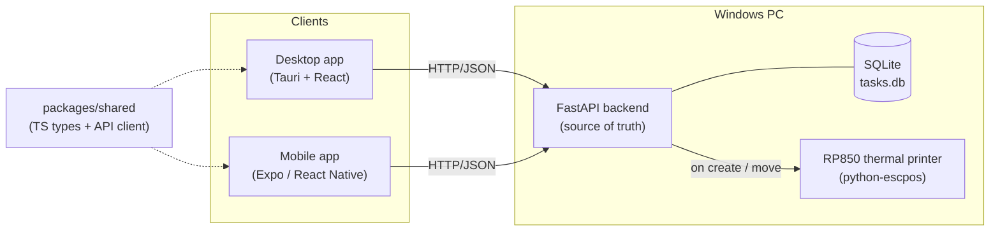

# TaskBoard — a receipt-printing Kanban

[](https://github.com/sierrajozajac/taskboard/actions/workflows/ci.yml)

A real, cross-platform task board where **every new task and every status change prints to a
thermal receipt printer** (a Rongta RP850). Organize work into **subjects** (boards) and
**swimlanes**, track **progress** and **comments**, from a **desktop app** or a **phone**.

> Portfolio project. One backend of record, two clients, and a physical side effect: your tasks
> come out of a printer.

## Architecture



- **Backend** — FastAPI + SQLite, the single source of truth. Runs on the PC the printer is attached
  to. Reuses a sibling `rp850-printer` project (`build_receipt` / `get_printer`) to print.
- **Desktop** — Tauri (Rust shell) + React + TypeScript. Drag tasks between columns.
- **Mobile** — Expo / React Native. Move tasks and comment from your phone on the same network.
- **Shared** — one TypeScript package of API types + a typed client, used by both clients.

## Domain model

A board (**subject**) is a set of **swimlanes** — the status columns (Pending, In Progress,
Complete, …). A task lives in exactly one swimlane and carries progress and comments. Moving a task
to a different swimlane is the status change that prints a receipt.

See [`docs/02-data-model.md`](docs/02-data-model.md).

## Quickstart

Full prerequisites and step-by-step setup live in [`docs/00-setup.md`](docs/00-setup.md). The short
version:

### 1. Backend — FastAPI + SQLite

From the `api/` folder, create a virtualenv, install, and run:

**Windows — Command Prompt (cmd.exe):**
```bat
py -m venv .venv
.venv\Scripts\activate
pip install -e .
python -m app.seed                :: optional demo data
uvicorn app.main:app --reload     :: http://127.0.0.1:8000  (API docs at /docs)
```

**Windows — PowerShell:** same, but activate with `.venv\Scripts\Activate.ps1`.

**macOS / Linux (bash):**
```bash
python3 -m venv .venv && source .venv/bin/activate
pip install -e .
python -m app.seed
uvicorn app.main:app --reload
```

Printing is chosen in `api/.env` (copy it from `.env.example` first — `copy .env.example .env` on
Windows, `cp` on macOS/Linux):

- `PRINT_MODE=console` (default) — receipts render to the server log; **no printer needed**.
- `PRINT_MODE=printer` with `PRINTER_NAME` set — prints for real. Find the name with
  `py ..\..\rp850-printer\print_tasks.py --list`, and on Windows also install the printer deps:
  `pip install -r ..\..\rp850-printer\requirements.txt`.

### 2. Shared package + clients

From the **repo root** (npm workspaces):

```bash
npm install
npm run build:shared
```

Then pick a client:

| Command | What |
| --- | --- |
| `npm run dev --workspace desktop` | Board UI in your browser at http://localhost:1420 — **no Rust needed** |
| `npm run dev:desktop` | Native desktop window (Tauri — needs Rust, see [setup](docs/00-setup.md)) |
| `npm run dev:mobile` | Mobile app in Expo Go (point it at the PC's LAN IP) |

The API must be running for any client to load. Change the API URL in the desktop sidebar / the
mobile first screen if it isn't at `http://127.0.0.1:8000`.

## Repository layout

| Path | What |
| --- | --- |
| `api/` | FastAPI + SQLite backend, printer integration, tests |
| `packages/shared/` | Shared TypeScript types + API client |
| `desktop/` | Tauri + React desktop app |
| `mobile/` | Expo / React Native mobile app |
| `docs/` | Architecture, data model, printer integration write-ups + ADRs |

## Docs & tech write-ups

- [Setup guide](docs/00-setup.md) — prerequisites and step-by-step for API, desktop, mobile
- [Architecture](docs/01-architecture.md) — the shape and the reasoning
- [Data model & API reference](docs/02-data-model.md)
- [Printer integration](docs/03-printer-integration.md)
- [ADR 0001 — stack choices](docs/adr/0001-stack-choices.md)
