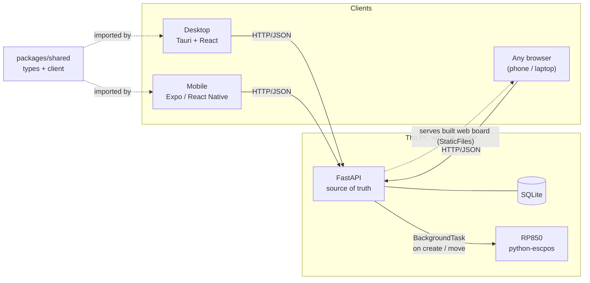

# Architecture

TaskBoard is a small system with one job and one twist. The job: a Kanban board with
subjects, swimlanes, tasks, progress, and comments. The twist: **the physical world reacts**:
creating or moving a task prints a receipt on a thermal printer.

That twist drives most of the design. A receipt printer is a stateful, side-effecting piece of
hardware attached to exactly one machine. So the system has a clear centre of gravity: **the
backend runs on the PC the printer is plugged into, and it is the only component that talks to the
hardware.** Everything else is a client.

## The pieces

- **`api/`: FastAPI + SQLite.** The single source of truth. Owns the data model, exposes a REST
  API, and is the only thing that prints. SQLite because the data is small, local, and single-writer;
  a file-backed DB is the right amount of database for a personal board. The API also **serves the
  built React board** (a `StaticFiles` mount over `desktop/dist`, see [`main.py`](../api/app/main.py)),
  so any browser can load the full UI at the API's own address.
- **`packages/shared/`: one TypeScript package.** The API's response shapes and a typed `fetch`
  client live here once and are imported by both native clients. One contract, several UIs.
- **`desktop/`: Tauri + React.** A real desktop window (Rust shell) around a React board with
  drag-and-drop between columns. The same React app is responsive: on a narrow screen the sidebar
  collapses into an off-canvas drawer, so the build the API serves works on a phone browser too.
- **`mobile/`: Expo / React Native.** A phone companion, run through **Expo Go**, that reaches the
  same API over the LAN (or over a Tailscale mesh for remote use). The API URL is entered on the
  first screen and persisted on the device with AsyncStorage.

## Why these boundaries

**The backend is the source of truth, not the client.** Both clients are thin: they render server
state and POST intentions ("move task 12 to In Progress"). They never own data. This is what lets
two different UIs stay consistent, and it's what makes printing reliable, because the print
decision lives next to the printer, not in a UI that might be closed.

**Printing is a side effect of a state change, not an API of its own.** There is no "print this"
endpoint. Instead, the *move* and *create* endpoints fire a print job as a FastAPI
[`BackgroundTask`](https://fastapi.tiangolo.com/tutorial/background-tasks/). Two consequences:

1. The receipt reflects a change that actually happened and was persisted first.
2. Printing can never break the request. It runs after the response is sent, wrapped in
   `try/except` (see [`events.py`](../api/app/events.py)). An offline printer costs you a log line,
   not a failed task move.

**The printer is abstracted behind a tiny interface.** The formatter in
[`printing.py`](../api/app/printing.py) writes to anything exposing `.set/.text/.cut`. In
`PRINT_MODE=printer` that's a real `python-escpos` device (reused from the sibling
[`rp850-printer`](../../rp850-printer) project); in `PRINT_MODE=console` it's a shim that renders
the same receipt to the log. The whole app is therefore developable and demoable on a machine with
no printer attached, which is most machines.

## Request lifecycle: moving a task

1. A client sends `POST /tasks/12/move { "swimlane_id": 3 }`.
2. The route validates the task and that the target swimlane belongs to the same board.
3. It records the *old* swimlane name, updates the row, and commits. (If the target swimlane is
   "Complete"/"Done", progress snaps to 100%.)
4. It registers a background task with the resolved board / swimlane **names** (by value, so the
   task needs no DB session).
5. The response returns immediately. Afterward, the background task formats and prints the receipt,
   or logs a failure.

## One address, three clients (and remote access)

Because the API serves the built board itself, there is a single URL that is both the REST API and
the web UI. A desktop window, the Expo Go mobile app, and any browser all point at that one address.
Nothing about the backend changes when the address does, which is what makes remote use trivial:
join the PC and the phone to a private **Tailscale** mesh and use the PC's mesh IP as the address.
No ports are opened to the public internet, and the printer never leaves home. See
[setup](00-setup.md#3-use-it-from-a-browser-and-away-from-home-tailscale) for the steps.

## What this demonstrates

- A clean **client/server split** with a shared, typed contract.
- **Cross-platform delivery** (desktop, mobile via Expo Go, and any browser) from one API, one
  served web build, and one set of types.
- **Remote access without cloud infrastructure** by serving the UI from the API and reaching it over
  a private Tailscale mesh.
- **Hardware integration** treated the way side effects should be: isolated, best-effort, and
  swappable for a no-op in development.

See also: [data model](02-data-model.md) · [printer integration](03-printer-integration.md) ·
[ADR 0001](adr/0001-stack-choices.md).
